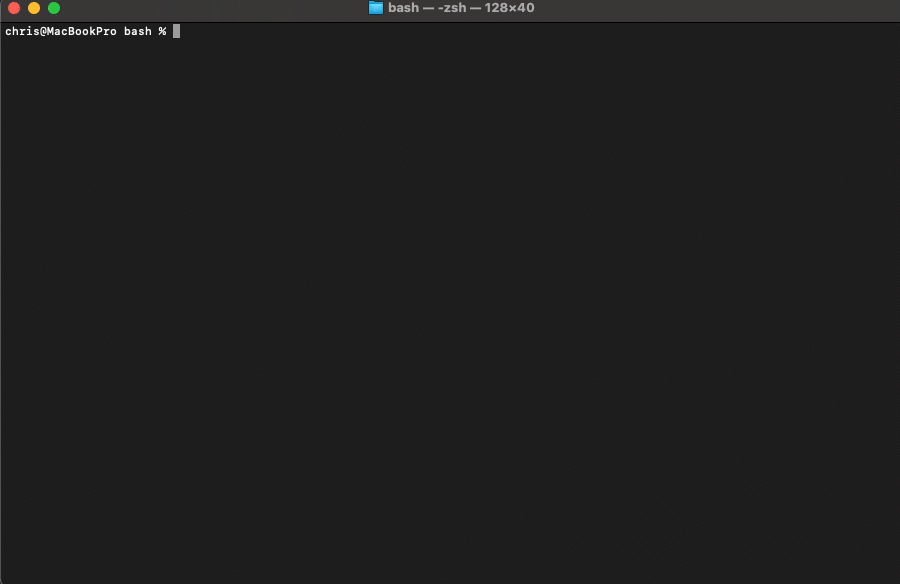

# azd-template-search.sh

Scrollable interactive Azure Developer CLI (`azd`) template selector (with arrow key support).

This script is designed to help you select an azd template interactively.
It uses the Azure Developer CLI (azd) to list available templates, and allows you to filter them by keyword or tag.



**Examples:**

```bash
./azd-template-search.sh -q litellm
./azd-template-search.sh -t mcp
./azd-template-search.sh -t ai
```

## Download Script

Use this script to download and run the script immediately, without saving:

```bash
bash <(curl https://raw.githubusercontent.com/Build5Nines/toolbox/refs/heads/main/scripts/azd/bash/azd-template-search/azd-template-search.sh)
```

Use this script to download and save the script locally for use:

```bash
# download and save script
curl https://raw.githubusercontent.com/Build5Nines/toolbox/refs/heads/main/scripts/azd/bash/azd-template-search/azd-template-search.sh > azd-template.search.sh
# make script executable
chmod +x azd-template.search.sh
# run it
./azd-template-search.sh
```

## Dependencies

This is a Bash / shell script that will work on macOS, Linux, or WSL. You will need to have the following installed to use this script:

- Azure Developer CLI
- `jq`
- `fzf`

## Usage

```text
# Usage:
# ./azd-template-search.sh [-q query] [-t tag]
#
# Options:
# -q   Filter templates by keyword (e.g., python, ai, bicep)
# -t   Filter templates by tag (e.g., bicep, webapps, ai)
```
